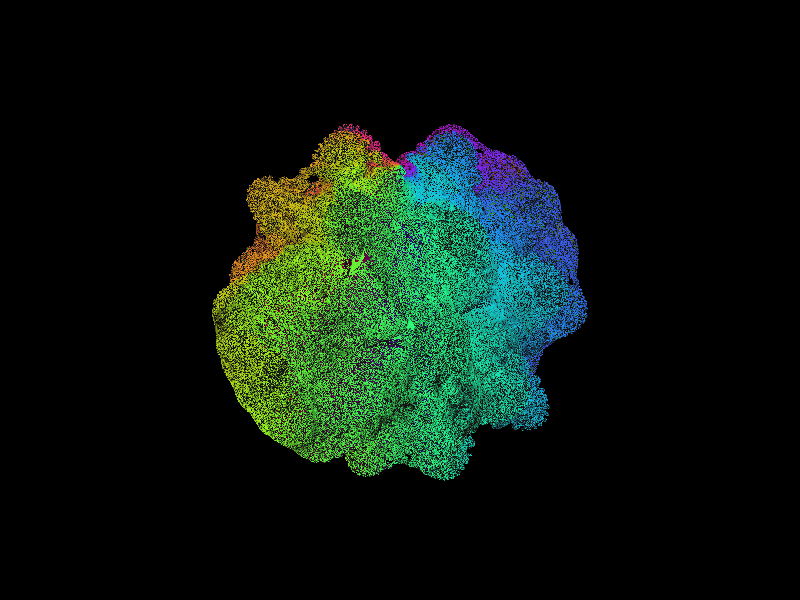

# Mandelbulb

An interactive, real-time ray-marched Mandelbulb fractal renderer written in Rust with a native GUI.



## Overview

This program renders a 3D Mandelbulb fractal using sphere tracing (ray marching) with a distance estimator derived from the Green's function of the Mandelbrot iteration extended to three dimensions. The interactive GUI (built with `egui`) allows real-time exploration of the fractal with live parameter adjustment.

### How it works

1. **Camera setup** — A virtual camera is positioned in 3D space looking at the origin, with configurable field of view.
2. **Ray marching** — For each pixel, a ray is cast into the scene. The ray advances in steps, where each step size is determined by the distance estimator.
3. **Distance estimator** — At each point along the ray, the Mandelbulb iteration `z_{n+1} = z^d + c` is run using spherical coordinates to compute the 3D "power" operation. The running derivative `dr` tracks orbit expansion, yielding the estimate `0.5 * r * ln(r) / dr`.
4. **Surface normals** — Estimated via central differences of the distance estimator (6 DE evaluations per hit).
5. **Shading** — Lambertian diffuse lighting with position-based rainbow coloring that wraps around the vertical axis, revealing the fractal's rotational symmetry, plus ambient occlusion for depth.

## Building and running

Requires Rust and Cargo.

```bash
cargo run --release
```

**Always use `--release`** — debug mode is 10-50x slower due to unoptimized floating-point math.

The application launches an interactive window with the Mandelbulb viewer.

## Interactive GUI Features

The application provides a side panel with real-time controls and a central viewport displaying the rendered fractal.

### Control Panel

**Camera Position** — Edit the (x, y, z) coordinates of the camera directly, or use keyboard controls to navigate in real-time.

**Light Position** — Adjust the position of the light source to change shading and shadows.

**Bulb Power** — Modify the Mandelbulb exponent (default 17.0). Lower values produce simpler shapes; higher values create more complex, detailed structures.

**Buttons:**
- **Render** — Trigger a fresh render at the current settings (useful after adjusting parameters)
- **KBD On/Off** — Toggle continuous keyboard-driven navigation
- **Orbit Cam / DeOrbit** — Enable automatic camera orbit around the fractal at a fixed distance

### Keyboard Controls (when KBD is enabled)

| Key | Action |
|-----|--------|
| W / S | Pan forward / backward |
| A / D | Pan left / right |
| Z / X | Move up / down |

All keyboard navigation triggers live re-rendering, allowing smooth real-time exploration.

### Orbit Camera Mode

When enabled, the camera automatically rotates around the fractal at a distance of 4.0 units from the origin, with continuous rendering. This is useful for hands-free exploration or creating animation reference.

## Configuration

### Compile-Time Configuration

Core rendering parameters can be adjusted in `src/config.rs`:

| Parameter | Default | Description |
|-----------|---------|-------------|
| `EYE` | (2.5, 2.5, 2.5) | Initial camera position |
| `TARGET` | (0, 0, 0) | Look-at point (center of scene) |
| `FOV` | π/6 | Field of view (30°) |
| `IMG_WIDTH` | 640 | Viewport width in pixels |
| `IMG_HGT` | 480 | Viewport height in pixels |
| `POWER` | 17.0 | Initial Mandelbulb exponent |
| `MAX_ITER` | 20 | Distance estimator iteration limit |
| `BAILOUT` | 2.0 | Orbit escape radius |
| `MAX_STEPS` | 200 | Ray march step limit |
| `SURFACE_EPS` | 0.00001 | Surface hit threshold (distance) |
| `MAX_DIST` | 10.0 | Maximum ray travel distance |
| `LIGHT_POS` | (2, 4, 3) | Initial light source position |

Most parameters can be adjusted in real-time via the GUI (camera position, light position, bulb power).

## Project structure

```
src/
  main.rs          Entry point
  config.rs        Rendering parameters
  mandelbulb.rs    Ray marcher, DE, shading, and image output
  point3d.rs       3D vector type with arithmetic operators
```

## Dependencies

- [egui](https://crates.io/crates/egui) — Immediate-mode GUI framework
- [eframe](https://crates.io/crates/eframe) — egui integration with native windows
- [image](https://crates.io/crates/image) — PNG image encoding (fallback for batch mode)
- [rayon](https://crates.io/crates/rayon) — Data parallelism for per-pixel rendering
